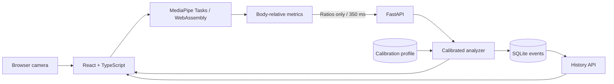

# Align Posture

**[alignposture.online](https://alignposture.online)** is a privacy-first,
full-stack posture coach. It learns a user's neutral
sitting position, analyzes webcam frames with MediaPipe, offers gentle real-time
feedback, and turns sessions into useful progress trends.


> Align Posture is a wellness aid, not a medical device. Camera images are processed
> inside the browser and never transmitted or saved. Only normalized body ratios,
> timestamps, and posture scores reach the local API.

## Product experience

1. **Welcome:** a clear explanation of value, privacy, and secure account access.
2. **Camera setup:** permission guidance and an on-screen positioning frame.
3. **Calibration:** six seconds of neutral posture creates a personal baseline.
4. **Live coach:** a low-distraction score, posture state, and one useful cue.
5. **Progress:** session summaries and posture-score trends over time.

The interface is responsive, keyboard accessible, reduced-motion aware, and
designed to avoid framing posture as a pass/fail test.

## Architecture



The scoring core is independent of HTTP, MediaPipe, and storage. Body
measurements are normalized by shoulder width; the median of 60 visible frames
forms the baseline. Changing user, chair, desk, or camera position calls for a
quick recalibration—not a hard-coded threshold.

## Technology

- React 18, TypeScript, Vite, Clerk, Recharts, and Lucide
- FastAPI, Pydantic, and SQLite
- Clerk's official Python SDK for session-token verification
- MediaPipe Tasks Vision running privately in browser WebAssembly
- Pytest, Vitest, Testing Library, GitHub Actions, and Docker

## Run locally

Python 3.10–3.12 and Node.js 20+ are supported.

```bash
git clone https://github.com/nilaycarleton/Posture_Detection_System.git
cd Posture_Detection_System

python -m venv .venv
source .venv/bin/activate          # Windows: .venv\Scripts\activate
python -m pip install -r requirements-dev.txt

cd frontend
npm install
cd ..

clerk auth login
clerk env pull --app app_3G67JeLvY73D9tqJrrt2ZwijneW --file .env.local
clerk env pull --app app_3G67JeLvY73D9tqJrrt2ZwijneW --file frontend/.env.local
```

Start the API and web app together from the repository root:

```bash
make dev
```

Keep that terminal open while using the application. You can alternatively run
`make api` and `make web` in two terminals. Make targets must be run from the
repository root; from inside `frontend`, use `npm run dev`. If your shell says
`python` is not found while creating the environment, use
`python3 -m venv .venv`.

Open [http://localhost:5173](http://localhost:5173), create an account, and
complete calibration. FastAPI documentation is
available at [http://localhost:8000/docs](http://localhost:8000/docs).

The Pose Landmarker model and WebAssembly runtime are served as local frontend
assets. `npm install` copies them into `frontend/public/`; those generated copies
are ignored by Git. The backend intentionally has no OpenCV, native MediaPipe,
GPU, or Metal dependency.

### Docker

```bash
docker compose --env-file .env.local up --build
```

Then open [http://localhost:8000](http://localhost:8000). The SQLite database is
stored in a persistent Docker volume.

## API surface

| Method | Endpoint | Purpose |
|---|---|---|
| `GET` | `/api/health` | Public service readiness |
| `GET` | `/api/status` | Signed-in user's calibration status |
| `POST` | `/api/calibrations` | Begin a personal calibration |
| `POST` | `/api/metrics` | Calibrate or analyze normalized body ratios |
| `POST` | `/api/calibrations/{id}/complete` | Save the calibrated profile |
| `POST` | `/api/sessions` | Start a coaching session |
| `POST` | `/api/sessions/{id}/complete` | End a session |
| `GET` | `/api/history` | Read scores and aggregate progress |

## Test and build

```bash
source .venv/bin/activate
python -m pytest

cd frontend
npm test
npm run build
```

GitHub Actions repeats backend tests on Python 3.10–3.12 and runs the frontend
test/build pipeline on Node.js 22.

## Performance evidence

The original prototype appended a CSV row, loaded the complete growing file,
and redrew a Matplotlib chart on every frame. The new backend records an event
directly in SQLite and retrieves history only when requested.

The retained legacy-vs-buffered microbenchmark is reproducible:

```bash
make benchmark
cat benchmark/results/latest.json
```

The checked-in run measured a **47.62× history-pipeline speedup**. This result
does not claim MediaPipe or webcam FPS. The old “2.5 → 20 FPS” claim remains
unverified until both revisions are tested against the same recorded video with
documented hardware, resolution, warm-up, and repeated trials.

## Repository map

```text
frontend/                 React user experience
  src/components/         Camera, navigation, and analytics UI
  src/hooks/              Browser camera lifecycle
backend/
  auth.py                 Clerk token verification and origin allowlist
  main.py                 FastAPI routes and application state
  database.py             SQLite persistence and analytics
posture_detection/
  core.py                 Calibration and posture scoring
benchmark/                Reproducible pipeline benchmark
tests/                    Backend and core tests
```

## Current limitations

- Production deployment still needs the custom Clerk domain configured for
  `alignposture.online`.
- An RGB webcam cannot measure spinal position with clinical accuracy.
- Low light, occlusion, loose clothing, and extreme angles reduce confidence.
- The fixed-video end-to-end benchmark and real-user validation study remain
  planned work.
- A truthful demo GIF still requires a consented webcam recording.

The original `main.py`, `main.cpp`, and `distance.cpp` are retained as a visible
record of the system's evolution from a Grade 12 prototype to a full-stack
machine-learning product.
